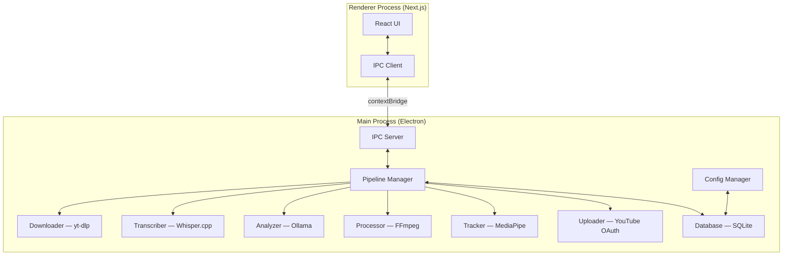
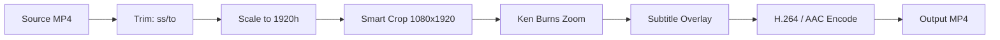

# Design Document — AI Shorts Generator

## Overview

The AI Shorts Generator is a local-first desktop application that transforms long-form YouTube videos into viral short-form clips with zero cloud dependency. It is built as an Electron shell hosting a Next.js renderer, with all AI workloads (transcription, hook detection, face tracking) running on the user's machine.

The application follows a linear pipeline: **Download → Transcribe → Analyze → Process → Export → Upload**. Each stage is orchestrated by the Electron main process and communicated to the renderer via a typed IPC bridge. All state is persisted in a local SQLite database.

The UI aesthetic is inspired by Opus Clip, Linear, and Notion — dark-first, minimal chrome, generous whitespace, and purposeful motion. The design system uses Tailwind CSS with shadcn/ui primitives customized to a monochromatic dark palette with a single accent color.

---

## Architecture

### High-Level System Diagram



### Process Separation

Electron enforces a hard boundary between the **main process** (Node.js, full OS access) and the **renderer process** (Chromium sandbox). All file I/O, child process spawning, and native module access live exclusively in the main process. The renderer is a pure UI layer that communicates through a narrow, typed IPC bridge exposed via `contextBridge`.

```
Main Process responsibilities:
  - Spawning and managing yt-dlp, FFmpeg, Whisper.cpp, MediaPipe child processes
  - Ollama HTTP client calls
  - SQLite read/write via better-sqlite3
  - YouTube OAuth token management and API calls
  - File system operations (move, delete, stat)
  - Config file read/write

Renderer Process responsibilities:
  - All React/Next.js UI rendering
  - User input collection and validation
  - Progress display and state visualization
  - In-app video playback via HTML5 <video>
  - Invoking main-process operations via IPC
```

### Folder Structure

```
ai-shorts-generator/
├── electron/
│   ├── main.ts                  # Electron entry point, BrowserWindow setup
│   ├── preload.ts               # contextBridge IPC exposure
│   ├── ipc/
│   │   ├── handlers.ts          # All ipcMain.handle() registrations
│   │   └── channels.ts          # Shared channel name constants
│   ├── pipeline/
│   │   ├── PipelineManager.ts   # Orchestrates stage execution
│   │   ├── Downloader.ts        # yt-dlp wrapper
│   │   ├── Transcriber.ts       # Whisper.cpp wrapper
│   │   ├── Analyzer.ts          # Ollama HTTP client + prompt logic
│   │   ├── Processor.ts         # FFmpeg command builder + executor
│   │   ├── Tracker.ts           # MediaPipe face detection
│   │   └── Uploader.ts          # YouTube Data API v3 OAuth client
│   ├── db/
│   │   ├── database.ts          # better-sqlite3 connection + migrations
│   │   ├── schema.sql           # DDL for all tables
│   │   └── repositories/
│   │       ├── ProjectRepo.ts
│   │       ├── TranscriptRepo.ts
│   │       ├── HookRepo.ts
│   │       └── ClipRepo.ts
│   ├── config/
│   │   └── ConfigManager.ts     # electron-store wrapper
│   └── utils/
│       ├── ffprobe.ts           # Video metadata extraction
│       ├── diskUsage.ts         # Storage monitoring
│       └── logger.ts            # Structured logging (pino)
├── renderer/
│   ├── app/                     # Next.js App Router pages
│   │   ├── layout.tsx           # Root layout, ThemeProvider
│   │   ├── page.tsx             # Dashboard (Projects list)
│   │   ├── import/
│   │   │   └── page.tsx         # URL import + download progress
│   │   ├── project/
│   │   │   └── [id]/
│   │   │       ├── page.tsx     # Project view (hooks, clips, transcript)
│   │   │       ├── hooks/
│   │   │       │   └── page.tsx # Hook review and selection
│   │   │       ├── clips/
│   │   │       │   └── page.tsx # Clip preview and export queue
│   │   │       └── upload/
│   │   │           └── page.tsx # YouTube upload form
│   │   └── settings/
│   │       └── page.tsx         # Settings panel
│   ├── components/
│   │   ├── ui/                  # shadcn/ui base components
│   │   ├── layout/
│   │   │   ├── Sidebar.tsx
│   │   │   └── TopBar.tsx
│   │   ├── import/
│   │   │   ├── UrlInput.tsx
│   │   │   └── DownloadProgress.tsx
│   │   ├── project/
│   │   │   ├── HookCard.tsx
│   │   │   ├── HookTimeline.tsx
│   │   │   ├── ClipPlayer.tsx
│   │   │   └── TranscriptEditor.tsx
│   │   ├── export/
│   │   │   ├── ExportQueue.tsx
│   │   │   └── ExportQueueItem.tsx
│   │   └── settings/
│   │       └── DependencyStatus.tsx
│   ├── hooks/                   # React custom hooks
│   │   ├── useIpc.ts
│   │   ├── usePipelineStatus.ts
│   │   └── useProject.ts
│   ├── lib/
│   │   ├── ipc-client.ts        # Typed wrappers around window.electron
│   │   └── utils.ts
│   └── styles/
│       └── globals.css
├── shared/
│   └── types.ts                 # Shared TypeScript types (IPC payloads, DB models)
├── package.json
├── electron-builder.yml
└── next.config.js
```

---

## Components and Interfaces

### IPC Communication Layer

The IPC bridge is the single seam between renderer and main. All channels are defined as string constants in `shared/channels.ts` and typed in `shared/types.ts`.

```typescript
// shared/types.ts (excerpt)

export interface DownloadRequest {
  url: string;
  quality: '1080p' | '720p' | '480p' | '360p';
  outputDir: string;
}

export interface DownloadProgress {
  projectId: string;
  percent: number;
  speed: string;       // e.g. "3.2 MiB/s"
  eta: string;         // e.g. "00:01:23"
}

export interface TranscriptWord {
  word: string;
  startMs: number;
  endMs: number;
  confidence: number;
}

export interface Transcript {
  projectId: string;
  language: string;
  words: TranscriptWord[];
}

export interface Hook {
  id: string;
  projectId: string;
  startMs: number;
  endMs: number;
  viralScore: number;   // 0–100
  summary: string;
  dismissed: boolean;
}

export interface Clip {
  id: string;
  hookId: string;
  projectId: string;
  status: 'pending' | 'processing' | 'complete' | 'failed';
  outputPath: string | null;
  subtitleStyle: 'bold-white' | 'gradient-pop' | 'minimal-clean';
  subtitlePosition: 'lower-third' | 'upper-third' | 'center';
  zoomEnabled: boolean;
  errorMessage: string | null;
}

export interface ExportProgress {
  clipId: string;
  percent: number;
  eta: string;
}

export interface UploadRequest {
  clipId: string;
  title: string;
  description: string;
  tags: string[];
  privacy: 'public' | 'unlisted' | 'private';
}
```

**IPC Channels:**

| Channel | Direction | Payload | Description |
|---|---|---|---|
| `download:start` | invoke | `DownloadRequest` | Begin yt-dlp download |
| `download:progress` | on (event) | `DownloadProgress` | Real-time download progress |
| `transcribe:start` | invoke | `{ projectId }` | Begin Whisper.cpp transcription |
| `transcribe:progress` | on (event) | `{ projectId, percent }` | Transcription progress |
| `analyze:start` | invoke | `{ projectId }` | Begin Ollama hook detection |
| `hooks:list` | invoke | `{ projectId }` | Fetch hooks for a project |
| `hook:update` | invoke | `Partial<Hook>` | Update hook times or dismiss |
| `clip:generate` | invoke | `{ hookIds: string[] }` | Add hooks to export queue |
| `export:start` | invoke | `{ projectId }` | Begin rendering export queue |
| `export:progress` | on (event) | `ExportProgress` | Per-clip render progress |
| `upload:auth` | invoke | `{}` | Initiate YouTube OAuth flow |
| `upload:start` | invoke | `UploadRequest` | Upload clip to YouTube |
| `upload:progress` | on (event) | `{ clipId, percent }` | Upload progress |
| `project:list` | invoke | `{}` | List all projects |
| `project:get` | invoke | `{ projectId }` | Get single project with clips |
| `project:delete` | invoke | `{ projectId, deleteFiles }` | Delete project |
| `settings:get` | invoke | `{}` | Get all settings |
| `settings:set` | invoke | `Partial<AppSettings>` | Update settings |
| `deps:check` | invoke | `{}` | Check dependency status |

**Preload bridge:**

```typescript
// electron/preload.ts
import { contextBridge, ipcRenderer } from 'electron';

contextBridge.exposeInMainWorld('electron', {
  invoke: (channel: string, ...args: unknown[]) =>
    ipcRenderer.invoke(channel, ...args),
  on: (channel: string, listener: (...args: unknown[]) => void) => {
    ipcRenderer.on(channel, (_event, ...args) => listener(...args));
    return () => ipcRenderer.removeAllListeners(channel);
  },
});
```

---

### Pipeline Manager

`PipelineManager` is the main-process orchestrator. It sequences pipeline stages, manages concurrency, and emits progress events back to the renderer.

```typescript
class PipelineManager {
  async runDownload(req: DownloadRequest): Promise<Project>
  async runTranscription(projectId: string): Promise<Transcript>
  async runAnalysis(projectId: string): Promise<Hook[]>
  async runExportQueue(projectId: string): Promise<void>
  async runUpload(req: UploadRequest): Promise<string>  // returns YouTube URL
  cancelStage(projectId: string, stage: PipelineStage): void
}
```

---

### Downloader (yt-dlp)

Spawns `yt-dlp` as a child process. Parses `--progress-template` JSON output to emit typed `DownloadProgress` events.

```typescript
class Downloader {
  async download(req: DownloadRequest): Promise<{ filePath: string; title: string; duration: number }>
  cancel(projectId: string): void
}
```

**yt-dlp invocation:**
```
yt-dlp \
  --format "bestvideo[height<=1080][ext=mp4]+bestaudio[ext=m4a]/best[height<=1080]" \
  --merge-output-format mp4 \
  --progress-template "%(progress._percent_str)s|%(progress._speed_str)s|%(progress._eta_str)s" \
  --output "%(title)s.%(ext)s" \
  <URL>
```

Retry logic: up to 3 attempts with 5-second delay between retries, using `--retries 3` flag plus application-level retry loop.

---

### Transcriber (Whisper.cpp)

Invokes the `whisper-cli` binary (bundled or system-installed) with `--output-json` to produce word-level timestamps.

```typescript
class Transcriber {
  async transcribe(projectId: string, audioPath: string, language: string, modelSize: WhisperModelSize): Promise<Transcript>
}
```

**Whisper.cpp invocation:**
```
whisper-cli \
  --model models/ggml-<size>.bin \
  --language <lang> \
  --output-json \
  --word-timestamps true \
  --file <audio.wav>
```

The JSON output is parsed into `TranscriptWord[]`. Words with `probability < 0.6` are flagged with `confidence < 0.6` for the low-confidence subtitle rendering path.

Audio extraction (if needed) uses FFmpeg:
```
ffmpeg -i input.mp4 -vn -ar 16000 -ac 1 -f wav output.wav
```

---

### Analyzer (Ollama)

Makes HTTP calls to the local Ollama REST API (`http://localhost:11434/api/generate`). Uses a structured prompt that instructs the model to return JSON.

```typescript
class Analyzer {
  async detectHooks(projectId: string, transcript: Transcript, modelName: string): Promise<Hook[]>
}
```

**Prompt design:**

```
You are a viral content analyst. Given the following transcript with word-level timestamps,
identify between 3 and 20 high-engagement moments suitable for short-form video clips.

For each moment, return a JSON array with objects containing:
- startMs: start time in milliseconds
- endMs: end time in milliseconds  
- viralScore: integer 0-100 based on emotional intensity, narrative tension,
  surprising statements, actionable insights, and quotability
- summary: one sentence describing why this moment is engaging

Transcript:
<transcript_text_with_timestamps>

Return ONLY valid JSON. No explanation.
```

The response is parsed with `JSON.parse`. If parsing fails, the Analyzer retries with a stricter prompt up to 2 times. Hooks are validated: `startMs < endMs`, `viralScore` in `[0, 100]`, `summary` non-empty. Invalid hooks are discarded. The result is clamped to 3–20 hooks.

---

### Processor (FFmpeg)

Builds and executes FFmpeg filter graphs for trimming, cropping, subtitle burning, and zoom effects.

```typescript
class Processor {
  async generateClip(clip: Clip, hook: Hook, transcript: Transcript, cropData: CropFrame[]): Promise<string>
  async renderSubtitles(clip: Clip, subtitleBlocks: SubtitleBlock[]): Promise<void>
}
```

**FFmpeg Pipeline Stages:**



**Smart crop filter graph:**

The `CropFrame[]` array from the Tracker provides per-frame crop center coordinates `(cx, cy)`. These are converted to a `sendcmd` filter script that animates the crop window:

```
ffmpeg -i input.mp4 \
  -vf "
    scale=-2:1920,
    sendcmd=f=crop_commands.txt,
    crop=1080:1920:cx:cy,
    zoompan=z='min(zoom+0.0005,1.15)':d=1:x='iw/2-(iw/zoom/2)':y='ih/2-(ih/zoom/2)',
    subtitles=subs.ass:force_style='...'
  " \
  -c:v libx264 -preset fast -crf 18 -b:v 4M \
  -c:a aac -b:a 256k \
  output.mp4
```

**Subtitle rendering:**

Subtitles are rendered as ASS (Advanced SubStation Alpha) format, which supports per-word styling. The `SubtitleBlock` objects are serialized to an `.ass` file with:
- Word-highlight animation using `\k` karaoke tags
- Low-confidence words rendered with `\i1` (italic) and reduced alpha
- Position controlled by `\an` alignment tags (lower-third = `\an2`, upper-third = `\an8`, center = `\an5`)
- Maximum 3 words per line enforced during block construction

**Subtitle style presets:**

| Preset | Font | Size | Primary Color | Outline | Shadow |
|---|---|---|---|---|---|
| Bold White | Arial Black | 72 | `&H00FFFFFF` | 4px black | 2px |
| Gradient Pop | Montserrat ExtraBold | 68 | `&H0000FFFF` (yellow) | 3px black | 0px |
| Minimal Clean | Inter Medium | 56 | `&H00FFFFFF` | 1px dark gray | 0px |

---

### Tracker (MediaPipe)

Runs MediaPipe Face Detection in a Node.js worker thread using `@mediapipe/tasks-vision` (WASM backend). Processes video frames extracted by FFmpeg at 5 fps to produce `CropFrame[]`.

```typescript
interface CropFrame {
  frameIndex: number;
  timestampMs: number;
  cx: number;   // crop center X (pixels in 1920h-scaled space)
  cy: number;   // crop center Y
  hasFace: boolean;
}

class Tracker {
  async analyzeVideo(videoPath: string): Promise<CropFrame[]>
}
```

**Frame extraction:**
```
ffmpeg -i input.mp4 -vf "fps=5,scale=-2:1920" -f image2 frames/%06d.jpg
```

Each frame is processed by MediaPipe. The bounding box center of the highest-confidence face detection is used as `(cx, cy)`. If no face is detected, `cx = videoWidth / 2`, `cy = videoHeight / 2` (center fallback). The crop window is smoothed with an exponential moving average (`α = 0.15`) to prevent jitter. Pan speed is capped at 20% of frame width per second.

---

### Uploader (YouTube OAuth)

Uses the Google APIs Node.js client (`googleapis`) with OAuth 2.0. Tokens are stored in the OS keychain via `keytar`.

```typescript
class Uploader {
  async authenticate(): Promise<void>           // Opens browser for OAuth consent
  async refreshTokenIfNeeded(): Promise<void>
  async upload(req: UploadRequest, filePath: string, onProgress: (pct: number) => void): Promise<string>
  async revokeAuth(): Promise<void>
}
```

**OAuth flow:**
1. Main process opens a local HTTP server on `localhost:3456` to receive the OAuth callback.
2. Opens the Google OAuth consent URL in the system browser via `shell.openExternal`.
3. Receives the authorization code, exchanges it for access + refresh tokens.
4. Stores refresh token in keychain under key `ai-shorts-generator:youtube-refresh-token`.
5. On subsequent uploads, loads refresh token from keychain and calls `oauth2Client.refreshAccessToken()` silently.

**Upload:**
Uses `youtube.videos.insert` with `uploadType: 'resumable'` and streams the file. Progress is tracked via the `googleapis` upload progress event. Retry: up to 3 attempts with exponential backoff (1s, 2s, 4s).

---

## Data Models

### SQLite Schema

```sql
-- Projects
CREATE TABLE projects (
  id          TEXT PRIMARY KEY,          -- UUID v4
  source_url  TEXT NOT NULL,
  title       TEXT NOT NULL,
  file_path   TEXT NOT NULL,
  duration_ms INTEGER NOT NULL,
  thumbnail   TEXT,                      -- base64 or file path
  language    TEXT NOT NULL DEFAULT 'en',
  quality     TEXT NOT NULL DEFAULT '1080p',
  created_at  INTEGER NOT NULL,          -- Unix timestamp ms
  updated_at  INTEGER NOT NULL
);

-- Transcripts (one per project)
CREATE TABLE transcripts (
  id          TEXT PRIMARY KEY,
  project_id  TEXT NOT NULL REFERENCES projects(id) ON DELETE CASCADE,
  language    TEXT NOT NULL,
  words_json  TEXT NOT NULL,             -- JSON: TranscriptWord[]
  is_empty    INTEGER NOT NULL DEFAULT 0,
  created_at  INTEGER NOT NULL
);

-- Hooks
CREATE TABLE hooks (
  id           TEXT PRIMARY KEY,
  project_id   TEXT NOT NULL REFERENCES projects(id) ON DELETE CASCADE,
  start_ms     INTEGER NOT NULL,
  end_ms       INTEGER NOT NULL,
  viral_score  INTEGER NOT NULL,         -- 0–100
  summary      TEXT NOT NULL,
  dismissed    INTEGER NOT NULL DEFAULT 0,
  created_at   INTEGER NOT NULL
);

-- Clips
CREATE TABLE clips (
  id               TEXT PRIMARY KEY,
  project_id       TEXT NOT NULL REFERENCES projects(id) ON DELETE CASCADE,
  hook_id          TEXT NOT NULL REFERENCES hooks(id) ON DELETE CASCADE,
  status           TEXT NOT NULL DEFAULT 'pending',  -- pending|processing|complete|failed
  output_path      TEXT,
  subtitle_style   TEXT NOT NULL DEFAULT 'bold-white',
  subtitle_position TEXT NOT NULL DEFAULT 'lower-third',
  zoom_enabled     INTEGER NOT NULL DEFAULT 1,
  error_message    TEXT,
  youtube_url      TEXT,
  created_at       INTEGER NOT NULL,
  updated_at       INTEGER NOT NULL
);

-- Settings (single-row key-value store)
CREATE TABLE settings (
  key   TEXT PRIMARY KEY,
  value TEXT NOT NULL
);

-- Indexes
CREATE INDEX idx_hooks_project ON hooks(project_id);
CREATE INDEX idx_clips_project ON clips(project_id);
CREATE INDEX idx_clips_hook    ON clips(hook_id);
CREATE INDEX idx_transcripts_project ON transcripts(project_id);
```

### App Settings Schema

```typescript
interface AppSettings {
  downloadDir: string;
  exportDir: string;
  whisperModelSize: 'tiny' | 'base' | 'small' | 'medium' | 'large';
  ollamaModel: string;           // default: 'llama3'
  defaultSubtitleStyle: 'bold-white' | 'gradient-pop' | 'minimal-clean';
  defaultVideoQuality: '1080p' | '720p' | '480p' | '360p';
  defaultSubtitlePosition: 'lower-third' | 'upper-third' | 'center';
  youtubeClientId: string;
  youtubeClientSecret: string;
}
```

Settings are persisted via `electron-store` (JSON file in `app.getPath('userData')`), not in SQLite, to allow access before the database is initialized.

---

## UI Design System

### Design Principles

The UI follows a **dark-first, content-forward** aesthetic:
- **Background**: `#0A0A0A` (near-black) with `#111111` card surfaces
- **Borders**: `#1E1E1E` (subtle, 1px)
- **Text primary**: `#F5F5F5`; **Text secondary**: `#888888`
- **Accent**: `#6366F1` (indigo-500) for CTAs, progress, and active states
- **Destructive**: `#EF4444` (red-500)
- **Success**: `#22C55E` (green-500)
- **Font**: Inter (UI), JetBrains Mono (timestamps, code)
- **Radius**: 8px cards, 6px inputs, 4px badges
- **Motion**: `ease-out` 150ms for micro-interactions, `ease-in-out` 300ms for page transitions

### Key Screens

**Dashboard** — Grid of project cards. Each card shows thumbnail, title, clip count, date, and a status badge. Empty state shows a large URL input centered on screen.

**Import** — Full-width URL input with format validation feedback. Below it: quality selector (segmented control), then a download progress card that expands inline with a progress bar, speed, and ETA.

**Project View** — Three-column layout:
- Left: Transcript panel (scrollable, editable words)
- Center: Hook list (ranked cards with score badge, timeline scrubber, dismiss button)
- Right: Clip preview player + subtitle style selector

**Export Queue** — Full-width list of clip items. Each item shows thumbnail, hook summary, status badge, progress bar (when processing), and action buttons (preview, upload, remove).

**Settings** — Two-column form. Left: grouped settings sections. Right: dependency status panel with green/red indicators per tool.

---

## Correctness Properties

*A property is a characteristic or behavior that should hold true across all valid executions of a system — essentially, a formal statement about what the system should do. Properties serve as the bridge between human-readable specifications and machine-verifiable correctness guarantees.*

---

### Property 1: URL Validation Accepts Valid Formats and Rejects Invalid Inputs

*For any* string input to the URL validator, the validator SHALL return `valid` if and only if the string matches a recognized YouTube URL pattern (standard `watch?v=`, shortened `youtu.be/`, or embed `/embed/` format), and SHALL return `invalid` with a descriptive reason for all other inputs.

**Validates: Requirements 1.1, 1.4**

---

### Property 2: Download Progress Parsing Extracts All Fields

*For any* yt-dlp progress template output string, the progress parser SHALL extract a numeric `percent` in `[0, 100]`, a non-empty `speed` string, and a non-empty `eta` string without throwing an exception.

**Validates: Requirements 1.3**

---

### Property 3: Project Record Round-Trip Persistence

*For any* valid project metadata object (containing `sourceUrl`, `filePath`, `title`, `durationMs`, `createdAt`, and all associated hooks, clips, and transcript), inserting it into SQLite and then retrieving it SHALL produce an object structurally equivalent to the original.

**Validates: Requirements 1.6, 9.1, 7.4**

---

### Property 4: Whisper.cpp Output Parsing Produces Complete TranscriptWord Records

*For any* valid Whisper.cpp JSON output, the transcript parser SHALL produce a `TranscriptWord[]` where every element has a non-empty `word` string, a non-negative `startMs`, an `endMs` greater than `startMs`, and a `confidence` value in `[0.0, 1.0]`.

**Validates: Requirements 2.2, 11.1**

---

### Property 5: Transcript Serialization Round-Trip

*For any* valid `Transcript` object (containing any number of `TranscriptWord` entries with arbitrary text, timestamps, and confidence scores), serializing it to JSON and then deserializing it SHALL produce a `Transcript` object structurally equivalent to the original, with all word texts, timestamps, and confidence scores preserved exactly.

**Validates: Requirements 11.2, 11.3**

---

### Property 6: Hook Viral Scores Are Always in [0, 100]

*For any* Ollama LLM response JSON (including responses with out-of-range, missing, or non-numeric score fields), the hook parser SHALL produce only `Hook` objects where `viralScore` is an integer in the closed interval `[0, 100]`.

**Validates: Requirements 3.2**

---

### Property 7: Hook Count Is Clamped to [3, 20]

*For any* Ollama response containing between 0 and 30 candidate hooks (when the source video has sufficient content), the Analyzer SHALL return a list of hooks with length in `[3, 20]`, selecting the highest-scoring hooks when truncating and surfacing an error when fewer than 3 valid hooks are found.

**Validates: Requirements 3.3**

---

### Property 8: Hook List Is Sorted by Viral Score Descending

*For any* list of `Hook` objects with arbitrary viral scores, the hooks displayed in the UI SHALL be ordered such that for every adjacent pair `(hooks[i], hooks[i+1])`, `hooks[i].viralScore >= hooks[i+1].viralScore`.

**Validates: Requirements 3.4**

---

### Property 9: Dismissing a Hook Does Not Affect Other Hooks

*For any* list of hooks and any single hook selected for dismissal, after the dismiss operation, all other hooks in the list SHALL have their `id`, `startMs`, `endMs`, `viralScore`, `summary`, and `dismissed` fields unchanged.

**Validates: Requirements 3.6**

---

### Property 10: Selected Hooks Are Added to Export Queue as Pending

*For any* non-empty set of hook IDs passed to the clip generation function, the resulting export queue SHALL contain exactly one `Clip` record per hook ID, each with `status = 'pending'`, and no additional clips SHALL be created.

**Validates: Requirements 4.1**

---

### Property 11: FFmpeg Trim Arguments Are Correctly Constructed

*For any* `(startMs, endMs)` pair where `0 <= startMs < endMs`, the FFmpeg command builder SHALL produce arguments containing `-ss <startMs/1000>` and `-to <endMs/1000>` (in seconds, with millisecond precision), and the output duration SHALL equal `(endMs - startMs) / 1000` seconds.

**Validates: Requirements 4.2**

---

### Property 12: Crop Center Correctly Targets Detected Face

*For any* face bounding box `(x, y, width, height)` detected in a 1920-height-scaled frame, the computed crop center `(cx, cy)` SHALL equal `(x + width/2, y + height/2)`, clamped so the 1080×1920 crop window stays within the source frame boundaries. When `hasFace = false`, `cx` SHALL equal `sourceWidth / 2` and `cy` SHALL equal `sourceHeight / 2`.

**Validates: Requirements 4.4, 4.5**

---

### Property 13: Crop Window Pan Speed Never Exceeds 20% of Frame Width Per Second

*For any* sequence of crop center coordinates produced by the Tracker's smoothing algorithm, the Euclidean distance between any two consecutive crop centers SHALL not exceed `0.20 * frameWidth` pixels per second (i.e., `0.20 * frameWidth / fps` pixels per frame).

**Validates: Requirements 4.6**

---

### Property 14: Transcript Segment Extraction Returns Only In-Range Words

*For any* `Transcript` and any time range `[startMs, endMs]`, the extracted subtitle segment SHALL contain exactly the words whose `startMs` falls within `[startMs, endMs]`, with no words outside the range included and no in-range words omitted.

**Validates: Requirements 5.1**

---

### Property 15: ASS Subtitle Output Contains Karaoke Tag for Every Word

*For any* `TranscriptWord[]` segment, the generated ASS subtitle file SHALL contain exactly one `\k` karaoke timing tag per word, with the tag duration matching the word's `(endMs - startMs)` value in centiseconds.

**Validates: Requirements 5.2**

---

### Property 16: Subtitle Position Maps to Correct ASS Alignment Tag

*For any* subtitle position value in `{'lower-third', 'upper-third', 'center'}`, the generated ASS style block SHALL contain the corresponding `\an` alignment tag: `\an2` for lower-third, `\an8` for upper-third, and `\an5` for center.

**Validates: Requirements 5.4**

---

### Property 17: Subtitle Lines Never Exceed 3 Words

*For any* sequence of `TranscriptWord` objects of arbitrary length, the subtitle line-wrapping function SHALL produce lines where every line contains at most 3 words, and no word is omitted or duplicated across lines.

**Validates: Requirements 5.5**

---

### Property 18: Low-Confidence Words Receive Distinct ASS Style Tag

*For any* `TranscriptWord` with `confidence < 0.6`, the generated ASS subtitle SHALL apply the low-confidence style override (italic tag `\i1` and reduced alpha) to that word's karaoke block. Words with `confidence >= 0.6` SHALL NOT receive the low-confidence style.

**Validates: Requirements 5.6**

---

### Property 19: Zoom Value Always Stays Within [1.0, 1.15]

*For any* clip duration and any zoom progression function, the zoom value at every frame SHALL be in the closed interval `[1.0, 1.15]`, and the crop window at maximum zoom SHALL remain fully within the source frame boundaries with no black borders.

**Validates: Requirements 6.1, 6.4**

---

### Property 20: FFmpeg Progress Output Is Correctly Parsed

*For any* FFmpeg progress output line containing `out_time_ms` and `total_size` fields, the progress parser SHALL extract a `percent` value in `[0, 100]` and a non-empty `eta` string without throwing an exception.

**Validates: Requirements 7.7**

---

### Property 21: Upload Metadata Is Fully Mapped to YouTube API Payload

*For any* `UploadRequest` object with arbitrary `title`, `description`, `tags`, and `privacy` values, the YouTube API request payload SHALL contain all four fields with values identical to the input, with no fields omitted or mutated.

**Validates: Requirements 8.3**

---

### Property 22: Dashboard Query Returns All Required Fields for Every Project

*For any* set of projects stored in SQLite, the dashboard list query SHALL return a record for every project containing `id`, `title`, `thumbnail`, `createdAt`, `clipCount` (count of associated clips), and `exportCount` (count of clips with `status = 'complete'`), with counts accurately reflecting the current database state.

**Validates: Requirements 9.2**

---

### Property 23: Project Deletion Removes All Associated Records

*For any* project with associated hooks, clips, and a transcript stored in SQLite, after deleting the project, no records with that `project_id` SHALL remain in the `hooks`, `clips`, or `transcripts` tables, and the project record itself SHALL be absent from the `projects` table.

**Validates: Requirements 9.4**

---

### Property 24: Disk Usage Calculation Is Correctly Summed

*For any* set of file size values (in bytes), the total disk usage function SHALL return the exact arithmetic sum of all file sizes, and the low-disk-space warning SHALL be triggered if and only if available free space is less than 5 GB (5,368,709,120 bytes).

**Validates: Requirements 9.6**

---

### Property 25: Settings Round-Trip Persistence

*For any* valid `AppSettings` object with arbitrary field values, saving it via `ConfigManager` and then loading it SHALL produce an `AppSettings` object structurally equivalent to the original, with all field values preserved exactly.

**Validates: Requirements 10.2**

---

### Property 26: Edited Transcript Text Is Used in Subtitle Render

*For any* `Transcript` where one or more word texts have been modified by the user, the ASS subtitle output SHALL contain the edited word text (not the original Whisper.cpp text) in the corresponding karaoke block, with timestamps preserved from the original.

**Validates: Requirements 11.4**

---

## Error Handling

### Pipeline Stage Errors

Each pipeline stage is isolated. A failure in one stage does not cascade to others unless explicitly sequenced.

| Stage | Error Condition | Handling |
|---|---|---|
| Downloader | Invalid URL | Validate before spawning; return typed error to renderer |
| Downloader | Network failure | Retry up to 3 times (5s delay); surface `DownloadFailedError` after exhaustion |
| Downloader | yt-dlp not found | Surface `DependencyMissingError` with install instructions |
| Transcriber | Whisper binary not found | Surface `DependencyMissingError` |
| Transcriber | Model file missing | Surface `ModelMissingError` with download button |
| Transcriber | Empty audio | Set `is_empty = 1` in DB; notify user; do not block pipeline |
| Analyzer | Ollama not running | Surface `OllamaUnavailableError` with start instructions |
| Analyzer | Model not pulled | Surface `ModelNotAvailableError` with `ollama pull` command |
| Analyzer | JSON parse failure | Retry with stricter prompt (max 2 retries); surface `AnalysisFailedError` |
| Analyzer | Fewer than 3 valid hooks | Surface `InsufficientHooksError`; allow user to proceed with available hooks |
| Processor | FFmpeg not found | Surface `DependencyMissingError` |
| Processor | Clip export failure | Log error; mark clip as `failed`; continue queue; surface in summary |
| Tracker | MediaPipe WASM load failure | Fall back to center-crop for entire clip; log warning |
| Uploader | OAuth token expired | Silent refresh via `refreshAccessToken()`; retry upload |
| Uploader | Upload network failure | Retry up to 3 times with exponential backoff (1s, 2s, 4s) |
| Uploader | Auth revoked | Surface `AuthRevokedError`; prompt re-authentication |
| Database | Malformed transcript JSON | Surface recovery option to re-run transcription; do not delete other project data |
| Database | Disk full | Surface `DiskFullError` before write; abort operation cleanly |

### Error Propagation Pattern

All main-process errors are serialized to a typed `AppError` object before being sent to the renderer via IPC:

```typescript
interface AppError {
  code: string;          // e.g. 'DEPENDENCY_MISSING', 'NETWORK_FAILURE'
  message: string;       // Human-readable description
  stage: PipelineStage;  // Which stage produced the error
  recoverable: boolean;  // Whether the user can retry
  details?: unknown;     // Optional structured context
}
```

The renderer maps `AppError.code` to a toast notification or inline error state. Unrecoverable errors disable the relevant action button and show a persistent error card.

### Dependency Checks

On application startup and on the Settings page, the application runs a dependency health check:

```typescript
interface DependencyStatus {
  name: 'yt-dlp' | 'ffmpeg' | 'whisper-cli' | 'ollama' | 'mediapipe';
  detected: boolean;
  version: string | null;
  path: string | null;
  error: string | null;
}
```

Each dependency is checked by running `<binary> --version` and parsing the output. Ollama is checked via `GET http://localhost:11434/api/tags`.

---

## Testing Strategy

### Overview

The testing strategy uses a dual approach: **property-based tests** for universal correctness guarantees and **example-based unit/integration tests** for specific behaviors, error conditions, and integration points.

### Property-Based Testing

**Library:** [fast-check](https://github.com/dubzzz/fast-check) (TypeScript-native, excellent arbitrary generators)

**Configuration:** Minimum 100 runs per property (`{ numRuns: 100 }`). CI runs use 500 runs. Each property test is tagged with a comment referencing its design property.

**Tag format:**
```typescript
// Feature: ai-shorts-generator, Property N: <property_text>
```

**Properties to implement as PBT tests** (from the 26 properties above):

| Property | Module Under Test | Key Arbitraries |
|---|---|---|
| 1 — URL Validation | `validateYouTubeUrl()` | `fc.string()`, URL pattern generators |
| 2 — Download Progress Parsing | `parseYtDlpProgress()` | Progress string generators |
| 3 — Project Record Round-Trip | `ProjectRepo` | `fc.record()` with project shape |
| 4 — Whisper Output Parsing | `parseWhisperOutput()` | Whisper JSON generators |
| 5 — Transcript Serialization Round-Trip | `serializeTranscript()` / `deserializeTranscript()` | `fc.array(fc.record({ word, startMs, endMs, confidence }))` |
| 6 — Hook Viral Score Bounds | `parseHooks()` | `fc.array(fc.record({ viralScore: fc.anything() }))` |
| 7 — Hook Count Clamping | `clampHooks()` | `fc.array(hookArbitrary, { minLength: 0, maxLength: 30 })` |
| 8 — Hook Sort Order | `sortHooksByScore()` | `fc.array(hookArbitrary)` |
| 9 — Hook Dismiss Isolation | `dismissHook()` | `fc.array(hookArbitrary)`, `fc.nat()` (index) |
| 10 — Export Queue Population | `addHooksToQueue()` | `fc.array(fc.uuid())` |
| 11 — FFmpeg Trim Arguments | `buildTrimArgs()` | `fc.tuple(fc.nat(), fc.nat()).filter(([s,e]) => s < e)` |
| 12 — Crop Center Computation | `computeCropCenter()` | `fc.record({ x, y, width, height })` |
| 13 — Pan Speed Limit | `smoothCropPath()` | `fc.array(fc.record({ cx, cy }))` |
| 14 — Transcript Segment Extraction | `extractSegment()` | `transcriptArbitrary`, `fc.tuple(fc.nat(), fc.nat())` |
| 15 — ASS Karaoke Tags | `buildAssSubtitles()` | `fc.array(transcriptWordArbitrary)` |
| 16 — ASS Alignment Tags | `buildAssStyle()` | `fc.constantFrom('lower-third', 'upper-third', 'center')` |
| 17 — Subtitle Line Wrapping | `wrapSubtitleLines()` | `fc.array(fc.string(), { minLength: 1 })` |
| 18 — Low-Confidence Styling | `buildAssSubtitles()` | `transcriptWordArbitrary` with `confidence` in `[0, 1]` |
| 19 — Zoom Bounds | `computeZoomValue()` | `fc.float({ min: 0, max: 100 })` (frame position) |
| 20 — FFmpeg Progress Parsing | `parseFfmpegProgress()` | FFmpeg progress line generators |
| 21 — Upload Metadata Mapping | `buildYouTubePayload()` | `fc.record({ title, description, tags, privacy })` |
| 22 — Dashboard Query Fields | `ProjectRepo.listForDashboard()` | `fc.array(projectArbitrary)` |
| 23 — Project Cascade Deletion | `ProjectRepo.delete()` | `projectWithRelationsArbitrary` |
| 24 — Disk Usage Calculation | `calculateDiskUsage()` | `fc.array(fc.nat())` (file sizes) |
| 25 — Settings Round-Trip | `ConfigManager.save()` / `ConfigManager.load()` | `appSettingsArbitrary` |
| 26 — Edited Transcript in Render | `buildAssSubtitles()` with edited transcript | `transcriptArbitrary`, `fc.array(fc.string())` (edits) |

### Unit Tests (Example-Based)

Focus on specific behaviors not covered by properties:

- Retry logic: exactly 3 retries for download and upload failures
- Quality tier → yt-dlp format string mapping
- Default Ollama model name is `'llama3'`
- Zoom disabled → FFmpeg command omits `zoompan` filter
- H.264/AAC codec arguments in export command
- OAuth token refresh on 401 response
- Subtitle style preset → distinct ASS style blocks
- Dependency version parsing for each binary
- Export queue: add, reorder, remove operations
- Confirmation dialog file list on project deletion

### Integration Tests

Run against real or mocked external processes:

- Download pipeline: mock yt-dlp binary → verify project created in SQLite
- Transcription pipeline: mock whisper-cli → verify transcript stored in SQLite
- Analysis pipeline: mock Ollama HTTP server → verify hooks stored in SQLite
- Export pipeline: mock FFmpeg → verify clips processed sequentially (no concurrency)
- Upload pipeline: mock YouTube API → verify OAuth flow and upload request shape
- Dependency health check: mock binaries → verify status correctly reported

### Test File Organization

```
tests/
├── unit/
│   ├── url-validator.test.ts
│   ├── progress-parsers.test.ts
│   ├── ffmpeg-builder.test.ts
│   ├── ass-subtitle-builder.test.ts
│   ├── crop-center.test.ts
│   ├── hook-parser.test.ts
│   └── settings.test.ts
├── property/
│   ├── url-validation.property.test.ts
│   ├── transcript-roundtrip.property.test.ts
│   ├── hook-invariants.property.test.ts
│   ├── subtitle-builder.property.test.ts
│   ├── crop-smoothing.property.test.ts
│   ├── project-persistence.property.test.ts
│   └── settings-roundtrip.property.test.ts
└── integration/
    ├── download-pipeline.integration.test.ts
    ├── transcription-pipeline.integration.test.ts
    ├── analysis-pipeline.integration.test.ts
    ├── export-pipeline.integration.test.ts
    └── upload-pipeline.integration.test.ts
```

**Test runner:** Vitest (compatible with Electron's Node.js environment, fast, native TypeScript support)

**Coverage target:** 80% line coverage on all `electron/pipeline/` and `electron/db/` modules.
